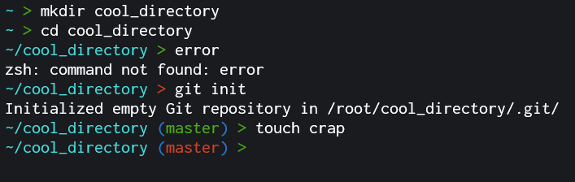

## Chill oh-my-zsh theme

### Features
- Shows full pwd
- Shows git status
- Shows command return status

### Screenshot




### Installation

Clone this repository in your oh-my-zsh custom themes folder :
```
git clone https://github.com/JKerboeuf/chill.zsh-theme.git ${ZSH_CUSTOM}/themes/Chill
```
Set the theme in your .zshrc :
```
ZSH_THEME="Chill/chill"
```
